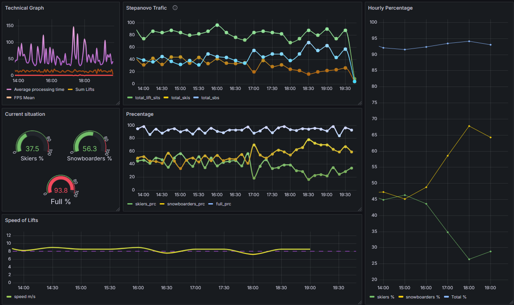
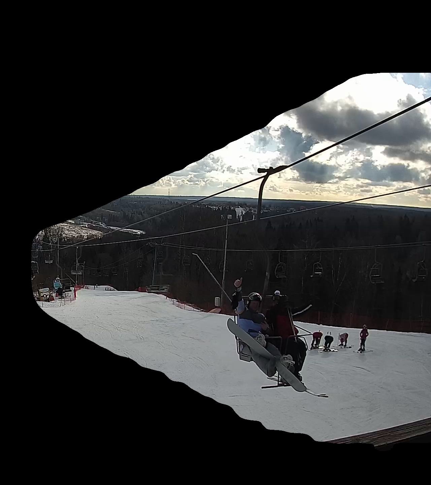

# Stepanovo Ski Lift Traffic Monitor 🏔️🚠

A project that counts skis, snowboards, and lifts in real-time video streams. Perfect for checking how busy your favorite mountain is!

I created this project as a personal challenge to complete in under two weeks during my spare time after work. Managed to pull it off and I'm pretty proud of pushing through! 😎



## What's Inside
- **Web-Socket Video Stream Parser**: To gather data and pass to YOLO
- **Video Analysis**: YOLO (Ultralytics) to spot skis, boards, and lifts
- **Data Storage**: PostgreSQL for keeping track of all the action
- **Dashboards**: Grafana to make pretty graphs 
- **Docker**: Because installing stuff is the worst part of any project

## Quick Start 🚀
1. Clone this repo
2. Run (you'll need Docker):
```bash
docker-compose up --build
```
  Check your dashboards at http://localhost:3000
  Note: It might take a few minutes to gather enough data!

## Data Collection Notes 📝

### The tricky parts:

  Decoding raw H264 format from websockets was a steep learning curve

  Collected mountain footage for a week (140GB+ of images!)


### Annotation process:

  Manually labeled 1000 images in CVAT

  Created ski, snowboard, and lift labels

  Then I examined the bboxes and made a heat map to see where is the interesting part of my frame. Why confuse the model and give it too much info? Let's keep it efficient.
  
  
  
  Masked irrelevant parts of the frame to focus on lift areas
  
  
  
  Used initial model predictions to speed up remaining annotations

  Exported labels in YOLO format.

  
## Algorithm Notes: 📝

  ### Had a few rules so the not super trained model would preform better.

  First, I've added a constraint that any class other than Lift should be inside the Lift BBox.
  Another constrain is that there could be maximum 2 BBoxes inside the Lift Bbox (We have 2 seated lifts only)
  Third algo checks how far did the lift move in pixels, if it's less than a certain value than we count that as the same lift.
### Had to make the model efficient to run on my PC, not impacting my everyday tasks.

I took YOLO11 s model, it works great and doesn't consume much memory and compute from my GPU. 
(At first this project was supposed to run on my server on xeon`s, but later I thought that It's too much of a hassle to bother)
As I mentioned before, the initial frame is processed by cutting it in half (we only need the right part of the image) then it applies the mask to block of unneeded information.

Want to see a live demo? Message me for access!